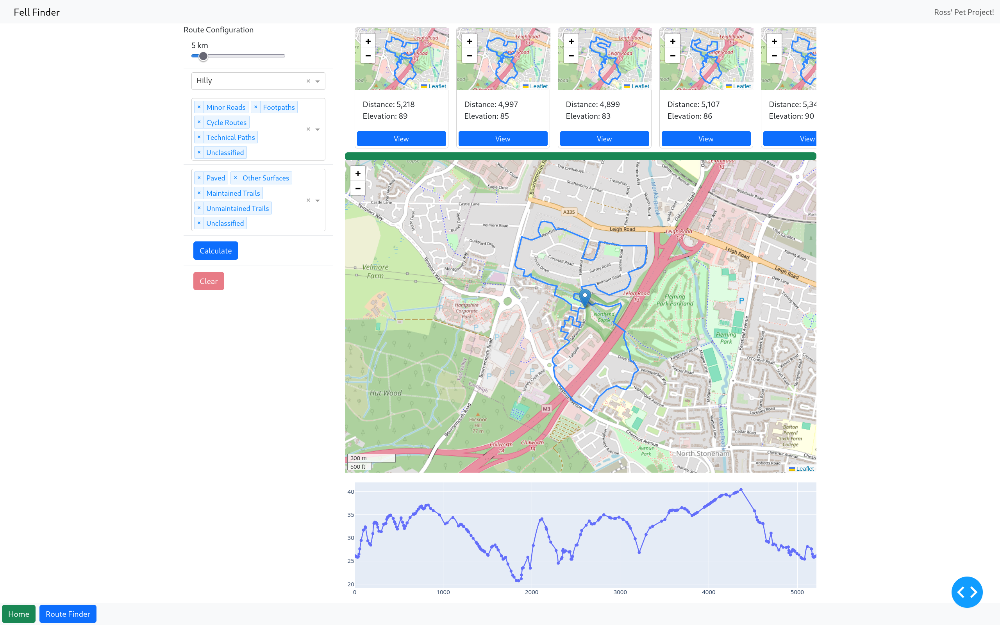

# Fell Finder

A personal project which aims to help you find the hilliest possible routes in your local area (so long as you're UK based). Development is typically limited to ~4 hours a week while I'm commuting in to the office, so new features may take a while to implement. You are welcome to use any of the code provided in this repo, so long as credit is given to me as the original author.



## Objectives

The aims of this project are twofold. Primarily, it is intended that the final product will be a webapp which can be used to generate superlative routes (the hilli**est**, the flatt**est**), as opposed to simply a 'hilly' route. Future builds are likely to include other features which make it easier for users to identify large hills to run up, and may go as far as to offer integrations with other popular services (Strava, Komoot) depending on which APIs are available.
The secondary objective is to provide myself with a challenge, and an opportunity to try out some different technologies. Once the current phase is complete (getting a fully tested PoC running locally, with an architecture I'm satisfied with), the next step will be setting everything up to scale and deploying it to the cloud.

## Current State

This project is still in early development, with significant work still required before it's ready for general use. That said, with a little leg-work a viable PoC is now up and running. At present, the ingestion pipeline is largely up and running (although it's executed on-demand at the moment). A basic webapp is provided, which is able to plot routes on demand and display them to the user. Route creation has been sped up significantly following a rewrite in rust, although longer distances can still take a few seconds to generate.

The rust portion of the code is currently in MVP state, and has a number of improvements which need to be made. This will be done at the same time as writing test cases to try and mop up any remaining logic issues. The overall structure of code in the repo is not yet final.


## Instructions for use

Eventually, everything will be set up to run in containers. Until then, it takes a bit of manual effort to set everything up

* Clone this repo to your local device
* Install prerequisites
  * [postgres](https://www.postgresql.org/download/)
  * [redis](https://redis.io/docs/latest/operate/oss_and_stack/install/install-redis/)
    * This is optional, not required to run in debug mode
    * `sudo systemctl start redis` to run it once, or `sudo systemctl enable redis` to run it every time your computer boots
  * [uv](https://docs.astral.sh/uv/getting-started/installation/)
  * [rust](https://www.rust-lang.org/tools/install)
  * python3-devel
    * python3.12-devel if your devault version isn't 3.12
  * [python build tools](https://devguide.python.org/getting-started/setup-building/#install-dependencies)
    * If you run into build errors with pyarrow, you can find the dependencies to install [here](https://arrow.apache.org/docs/developers/cpp/building.html)
    * If you run into build errors with numpy, you might need to install the C build tools. Use `dnf group install c-development development-tools` to install them on Fedora
  * [hatch](https://hatch.pypa.io/latest/install/)
* Build the [fell_finder](packages/fell_finder/README.md) package
* Run the [fell_loader](packages/fell_loader/README.md) package to get all of the required data into postgres
* Run the [fell_viewer](packages/fell_viewer/README.md) to start the webapp
    
## Environment Variables

Proper documentation for these is pending (as the list of variables is not yet complete). You will need the following environment variables set in order to run the code. The recommendation is that this be done with a `.env` file.

```
FF_DATA_DIR = /hpath/to/your/data/dir
FF_DEBUG_MODE = true
FF_MAX_CANDS = 2048
FF_MAX_SIMILARITY = 0.99
FF_DIST_TOLERANCE = 0.1
FF_DB_USER = your_db_user
FF_DB_PASS = your_db_pass
FF_ING_PTN_SIZE = 5000
FF_APP_NO_ROUTES = 10
```


## Roadmap

These new features are listed in approximate order of priority

### Execution

* Containerise everything
* Set up k8s/swarm to handle scaling, load balancing
* Deploy to the cloud

### Ingestion

* Identify ways to further improve the accuracy of calculated elevation gain/loss
  * Other sources of elevation data to be evaluated, candidates are OS Terrain and SRTM
  * Post-processing may be a valid tactic, smoothing out the profile for each edge in the graph
  * Further checks on the tags present in the OSM data may also help (tunnels, bridges, etc)
* Set up an airflow pipeline for ingestion, bring in data for all of the UK
  * Elevation unlikely to change much, but map data will
  * Spark profile may need tuning to handle increased volume
  * Check for OSM parsers which can evaluate lazily

### API

* Containerise everything
* Add max similarity parameter when getting dissimilar routes, apply it when getting final routes to show to user
* Improve route validation when surface restrictions are in place
  * Check on each step that configured max has not been exceeded
* Run profiling through again, check for any issues introduced by recent changes
* Improve error handling in Rust API, should be able to return other status codes
* Hyperparameter optimisation for created routes
  * Set up the API with a debug mode, return additional info about data used to create routes
  * Use regression model to set params?


### Frontend

* Set route creation callback to dynamically adjust max num. of candidates
  * Current approach proves the concept, but isn't optimal
* Bring back the progress bar!
  * Will require the ability to poll the API for progress, good development opportunity
* Build out the route finding page of the webapp
  * Page layout could stand to be improved, collapsible sidebars may help
* Formally define the expected end state of the webapp
  * Set out all of the different features to be built out
  * Define a target layout for each feature
  * This may include the following
    * Manual route plotting
    * Hill finder (find the largest/steepest climbs in the local area)
    * API integrations
      * This may then enable dashboards looking at past activity data
* Add user logins, allowing people to save & retrieve routes
* Create an admin dashboard to aid development & performance diagnostics


## Issues / Limitations

* Estimated gain/loss is typically ~30% higher than it should be, this needs to be investigated further
  * Part of the issue seems to be with the LIDAR data itself being a few metres out at times (vs. Strava)
  * Other issues include bridges/tunnels where the path stays level but the ground does not. Some mitigations are in place for this, but making better use of the OSM tags may be able to improve the situation further.
* Further investigation is needed around surface types, some local footpaths seem to be showing as paved. This may be an issue with the underlying data.
* Data is being combined into a limited number of partitions during the ingestion phase, causing higher memory usage than I would like
  * More in-depth analysis of the execution plan is required to debug this behaviour