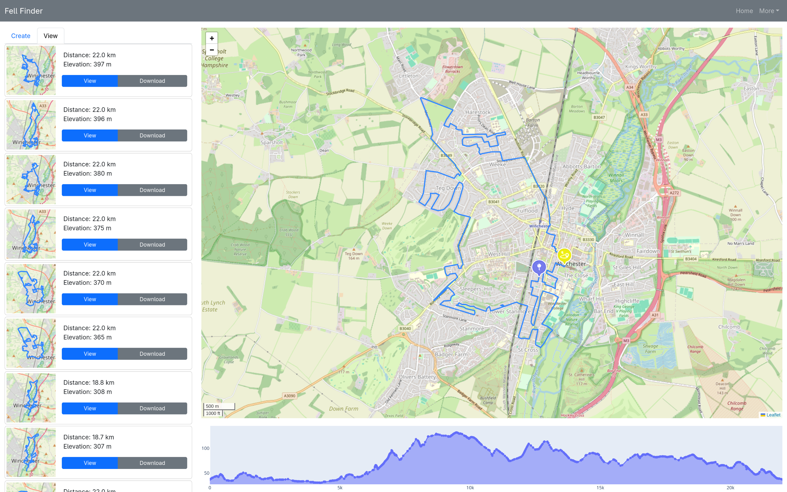

# Fell Finder

Fell Finder is a personal project which allows you to generate running routes in your local area (so long as you're UK based). It has been in active development for several years, and is the product of many hours spent commuting into London on the train. Due to time constraints and the limited connectivity on the trains, development proceeds at a slow but steady pace.

To the user, Fell Finder is a webapp which can be used to generate superlative routes (the hilli*est*, the flatt*est*), as opposed to simply a 'hilly' route. Future builds may include other features for the hill climbers among us, such as helping to identify the largest/steepest hills in the area. To me, it is predominantly an opportunity to learn new tools and technologies, and to improve my coding abilities.

## Contents

* [Setup](./docs/setup.md)
* [Usage](./docs/usage.md)
* [Roadmap](./docs/roadmap.md)
* [Changelog](./docs/changelog.md)
