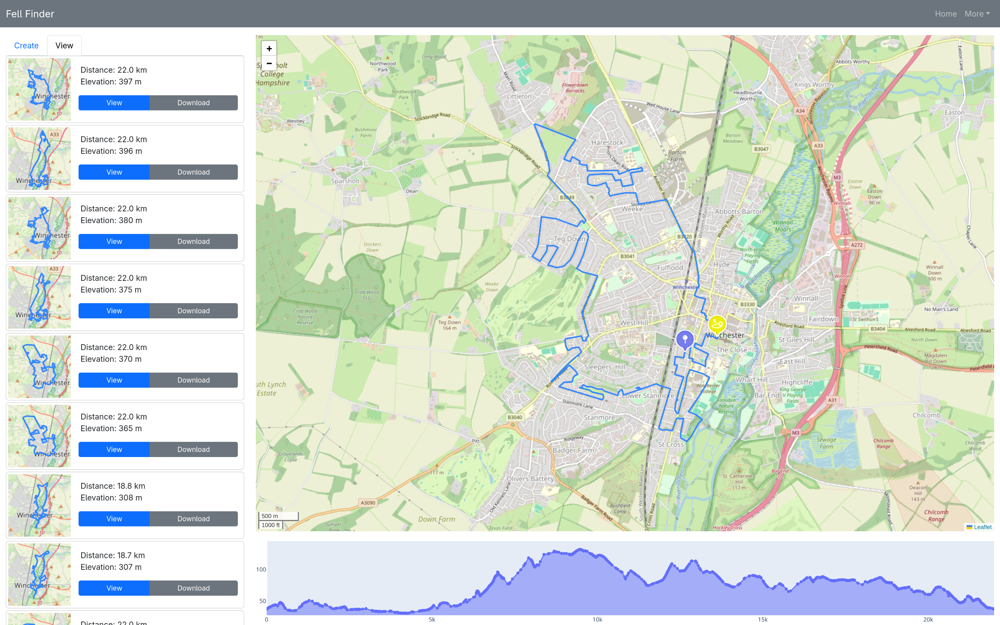

# Fell Finder

A personal project which aims to help you find the hilliest possible routes in your local area (so long as you're UK based). Development is typically limited to ~4 hours a week while I'm commuting in to the office, so new features may take a while to implement. You are welcome to use any of the code provided in this repo, so long as credit is given to me as the original author.

## Objectives

The aims of this project are twofold. Primarily, it is intended that the final product will be a webapp which can be used to generate superlative routes (the hilli**est**, the flatt**est**), as opposed to simply a 'hilly' route. Future builds are likely to include other features which make it easier for users to identify large hills to run up, and may go as far as to offer integrations with other popular services (Strava, Komoot) depending on which APIs are available.
The secondary objective is to provide myself with a challenge, and an opportunity to try out some different technologies. Once the current phase is complete (getting a fully tested PoC running locally, with an architecture I'm satisfied with), the next step will be setting everything up to scale and deploying it to the cloud.

## Current State

This project is still in early development, with significant work still required before it's ready for general use. That said, with a little leg-work a viable PoC is now up and running. At present, the ingestion pipeline is largely up and running (although it's executed on-demand at the moment). A basic webapp is provided, which is able to plot routes on demand and display them to the user. The route finding page of the webapp is not feature complete; there are no GPX exports, and only one route is displayed to the user. Routes are generally created in less than a minute for shorter distances (up to 10k), although the algorithm has been tested up to marathon distance. The route-finding algorithm needs further improvement to reduce execution time and increase completion rates.

## Instructions for use
* Configure the app for your system
  * As a short-term implementation, the config file is stored in `src/fell_finder/config.yml`
  * Set the data_dir to the (absolute) location of the 'data' subfolder on your device
  * Your data folder will need the following subdirectories:
    * extracts
      * osm
      * lidar
    * parsed
    * enriched
    * optimised
    * temp
* In extracts/osm, you'll need to place a .osm.pbf file covering the area you want
* In extracts/lidar, you'll need to place the corresponding (extracted) LIDAR data
  * This can be downloaded [here](https://environment.data.gov.uk/survey)
  * After selecting the area to download, select 'LIDAR Composite DTM / 2022 / 1m'
* Pip install this package and all of its requirements
* Install redis `sudo dnf install redis` on Fedora and set it to run
  * `sudo systemctl start redis` to run it once, or `sudo systemctl enable redis` to run it every time your computer boots
* Run `ingestion.py` to process your extracts.
  * In my own testing, it takes ~1 hour to completely process the data for all of Hampshire
* Once ingestion has completed, you can start the webapp in two modes

* For a 'standard' launch
  * Make sure 'debug' is set to False in `src/fell_finder/config.yml`
  * First, start Celery with: `celery -A webapp.celery_app worker --loglevel=INFO`
  * Then, without closing the celery process, start the webapp with `python webapp.py`
  * You can then access the webapp by opening 'http://localhost:8050/' in your browser
* For a 'debug' launch
  * Make sure 'debug' is set to True in `src/fell_finder/config.yml`
  * Start the webapp with `python webapp.py`

## Roadmap

These new features are listed in approximate order of priority

### Backend

* Build out support for GPX exports
* Update routing to include threshold for tarmac/trail composition
  * e.g. only return routes which are on tarmac for 25% or less of the total distance
  * This will also need to ensure full testing of all routing code, as dramatic performance gains seem unlikely without implementing the algorithm in a lower level language.
* Ensure full test coverage on any code which is not app-specific
* Containerise everything
* Set up an airflow pipeline for ingestion
* Deploy to the cloud
* Identify ways to further improve the accuracy of calculated elevation gain/loss
  * Values are typically quite close to Strava now, but there are some blips in the source LIDAR data which it may be possible to smooth out with software processing

### Frontend
* Build out the route finding page of the webapp
  * Page layout could stand to be improved, collapsible sidebars may help
  * Once the exporter is available, a download as GPX button needs adding
* Formally define the expected end state of the webapp
  * Set out all of the different features to be built out
  * Define a target layout for each feature
  * This may include the following
    * Manual route plotting
    * Hill finder (find the largest/steepest climbs in the local area)
    * API integrations
      * This may then enable dashboards looking at past activity data
* Add user logins, allowing people to save & retrieve routes
* Create an admin dashboard to aid development & performance diagnostics
