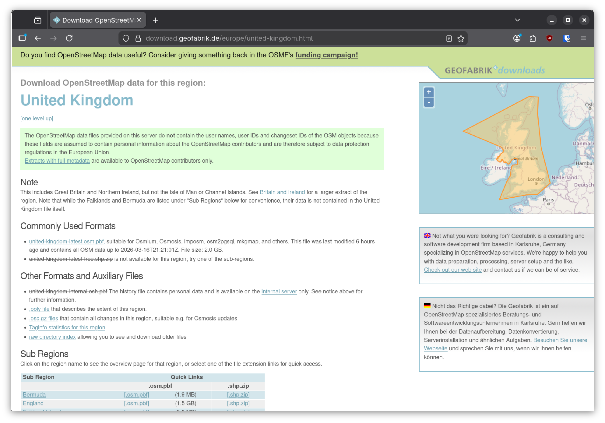
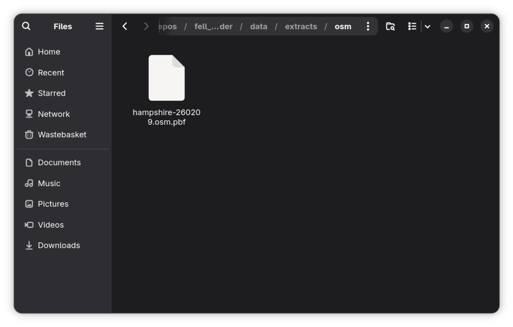
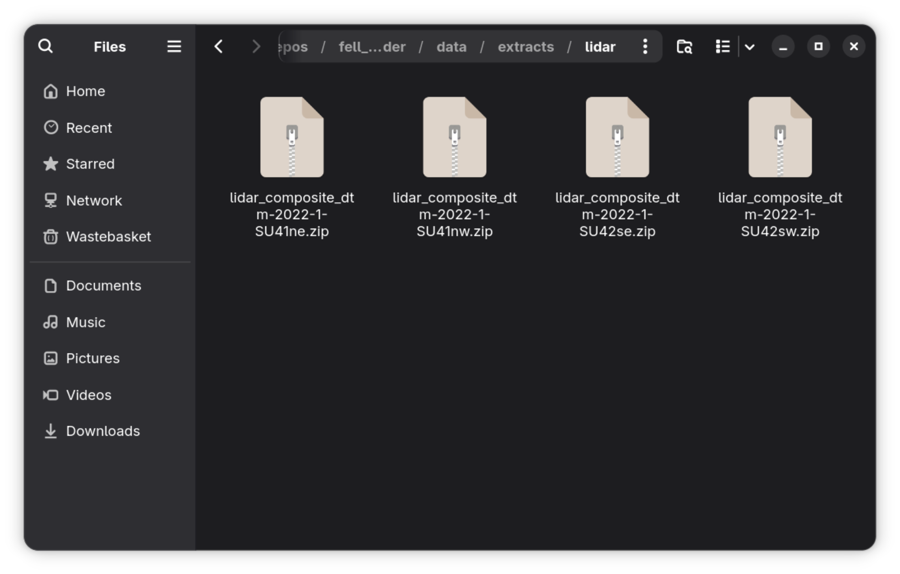
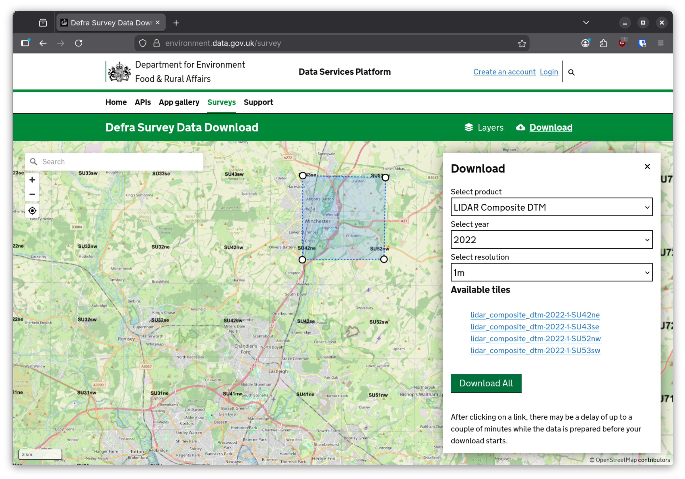

===================
Setup - Fell Loader
===================

The Fell Loader package is responsible for combining OSM data with elevation data from DEFRA. It is not possible to run the Fell Finder webapp without first having run Fell Loader through. The end product of this pipeline is a number of tables on a PostgreSQL database, which are required for the route creation algorithm to function.

Prerequisites
=============

As the data ingestion process runs locally, you will need sufficient storage and memory to run it through end-to-end. In order to process the 'full' dataset (map and elevation data for the whole UK), you will need:

* ~1.5 TB storage (HDD is sufficient)
* 32 GB RAM

Ideally, you will also need:

* ~32 GB on an NVME drive 
* A fast internet connection (~400 GB of files to download)

Data Files
==========

Before starting, you should create a dedicated folder (or partition) to hold all of the data required by the Fell Finder app. For the purposes of these instructions, I will refer to this folder as `/ff_data`, but it can be stored anywhere on your system.

OSM
---



First, you will need to download some map data. Fell Loader expects the 'osm.pbf' file format. I recommend using `geofabrik <https://download.geofabrik.de/europe/united-kingdom.html>`_ to download it. If you just want to try the webapp out with data from your local area, you can also select to download data just for a single county (e.g. `Hampshire <https://download.geofabrik.de/europe/united-kingdom/england/hampshire.html>`_).



Select to download the 'XX-latest.osm.pbf' file and place it into `/ff_data/extracts/osm`. You should end up with something like the above.

LIDAR
-----

The next step is to load in some elevation data, as this isn't provided in the OSM dataset. This is freely available through DEFRA. The access method will vary depending on whether you're doing a full load, or just testing the app out for a small area.



However you get the files, you'll need to place the .zip archives in `/ff_data/extracts/lidar`. You should end up with something like the above.

Manual Download
^^^^^^^^^^^^^^^



For small-scale data loads, you can use the `Survey Download <https://environment.data.gov.uk/survey>`_ tool. Simply draw a polygon around the area you want to load, and download the 'LIDAR Composite DTM' dataset at '1m' resolution.`

Bulk Download
^^^^^^^^^^^^^

For large-scale data loads, the method above is not practical. You should instead use the `large dataset request form <https://environment.data.gov.uk/support/datadownload>`_ to request access to the full dataset. While I am unable to provide screenshots, the outcome should be a set of time-limited credentials to an FTP server from which you can download the entire dataset. The full download is ~400 GB, so a fast internet connection is strongly recommended!

Configuration
=============

With the data in place, navigate to `./docker/fell_loader_compose.yaml`. You will need to make a few adjustments to get it running on your system.

Volumes
^^^^^^^

.. code-block:: yaml

    volumes:
        # Temp volumes to be removed after debug
        fell_loader:
            driver: local
            driver_opts:
                o: bind
                type: none
                device: /path/to/fell_finder/packages/fell_loader/src/fell_loader
        ff_src:
            driver: local
            driver_opts:
                o: bind
                type: none
                device: /path/to/fell_finder/src
        # Persistent volumes
        ff_data:
            driver: local
            driver_opts:
                o: bind
                type: none
                # Update this to match your data directory (slower storage OK)
                device: /ff_data
        ff_db:
            driver: local
            driver_opts:
                o: bind
                type: none
                # Update this to match your db directory (fast storage recommended)
                device: /path/to/ff_db/

You will need to update the `device` parameters to match your system. For `fell_loader` and `ff_src`, you can replace `/path/to_fell_finder` with the path you cloned this repo to. `/ff_data` will be the folder containing the data extracts.

`ff_db` is a special case, as it should ideally point to a folder (or volume) on fast storage (ideally an NVME drive). It will need to be an empty folder to start off with. Once the data load completes, this is where the files for the PostgreSQL database will be stored.

Environment Variables
^^^^^^^^^^^^^^^^^^^^^

There are a few settings to be tweaked which control resource allocation during the data load.

* FF_LIDAR_WORKERS - This sets the number of LIDAR files which will be loaded in parallel. If your data directory is on an HDD you should set this to either 2 or 4 as you will likely be bottlenecked by drive IO. If you're working on faster store, you should be able to bump it up to 8 without issues.
* SPARK_MASTER - Sets the processor allocation for Spark during the data load. It is recommended to leave this set to 'local[*]', but you can reduce the number of cores used if desired.
* SPARK_DRIVER_MEMORY - Sets the max memory usage by Spark during the data load. This should be set slightly below the amount of memory on your system.
* SPARK_DRIVER_MEMORY_OVERHEAD - Sets the memory overhead for Spark during the data load. Set this to either 2G or 4G.

All of the other variables in the file should not need to be changed.

Execution
=========

With data present and the compose file updated, you should now be ready to run the data ingestion script.

Build
-----

First, you need to build the `fell_loader` image. Future iterations will likely host this online, but for now pre-built images are not available. All of these commands should be run from the root of the repo.

First, we'll use UV to generate a requirements file:

```
uv pip compile packages/fell_loader/pyproject.toml -o dist/fell_loader_requirements.txt
```

Then, we'll build the image:

```
docker build -f docker/fell_loader.dockerfile --tag 'fell_loader' .
```

Run
---

Once the `fell_loader` image has been built, it can be executed with docker compose:

```
docker compose -f docker/fell_loader_compose.yaml up
```

Logs will be generated in the `docker` file which you can use to track progress as it runs.