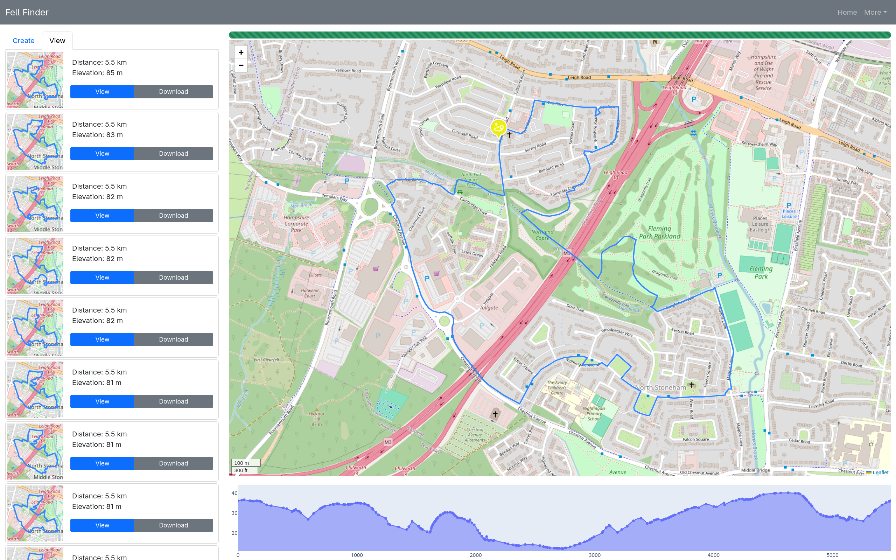
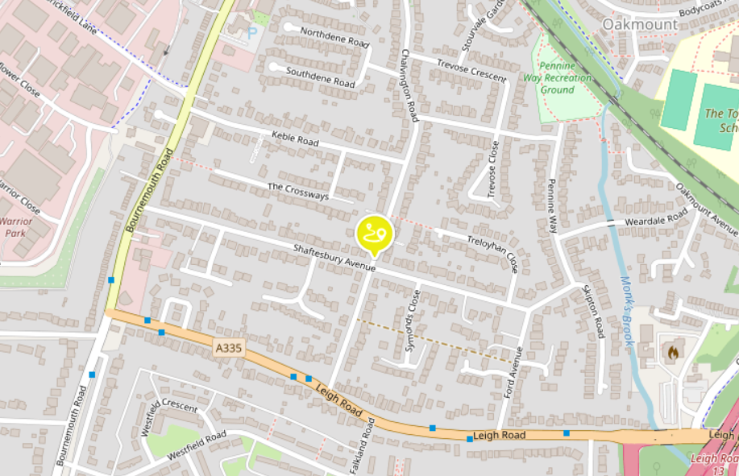
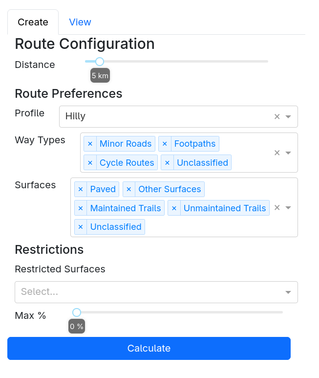
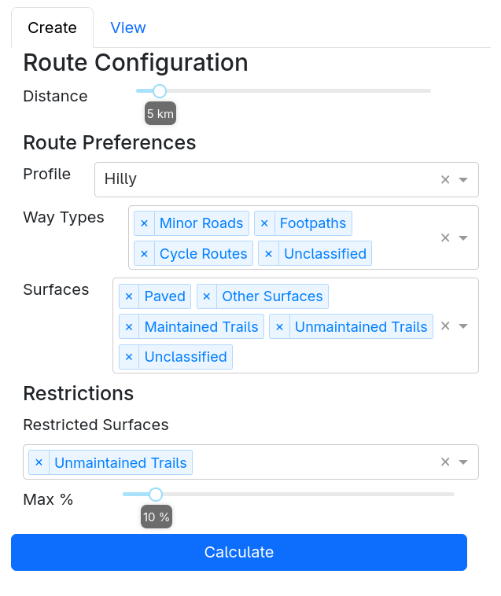
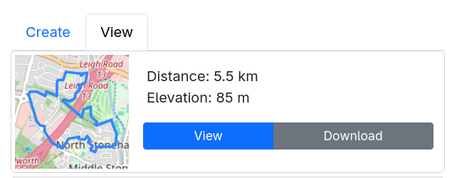
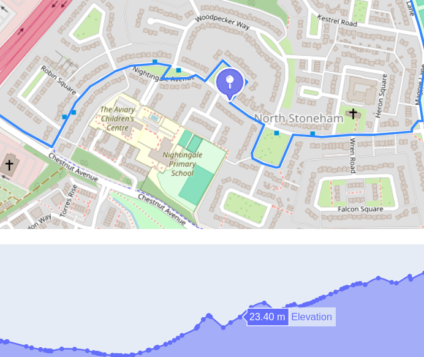

# Usage - Route Creation

The Route Creation page allows users to generate circular running routes based on a selected start point. The sidebar provides a number of controls which can be used to customise the type of route which is generated.

To select a start point, simply click on the map.

With a start point selected, you can now use the sidebar to customise the type of route which is generated.

* Distance: Sets the target distance for routes to be generated. At present, a variation of +- 10% is allowed (i.e. if distance is set to 5km, you will see routes between 4.5km and 5.5km).
* Profile: Sets the type of route which the app will focus on, either 'Hilly' or 'Flat'
* Way types: This allows you to set filters on the types of road/path which you are happy to run on. Click the 'X' to remove a way type, and use the dropdown to add more in.
  * Please note that unsafe roads will never be used, you'll never be sent along a motorway!
* Surfaces: This allows you to set filters on the surfaces which you are happy to run on. Click the 'X' to remove a surface type, and use the dropdown to add more in.
* Restrictions: In some cases, you might want to limit how much time you spend on a particular surface without excluding it completely. Select any surfaces you wish to restrict here, then set to maximum % of the total distance which will be spent on them. E.g. selecting 'Paved' with 'Max % = 10' will allow brief sections of pavement, while generating routes which are predominantly off-road.
  * If multiple surfaces are selected, all of them will count towards the limit. e.g. with 'Max % = 10' and both 'Maintained Trails' and 'Unmaintained Trails' selected, a route which is 7% comprised of each will not be valid (as 14% exceeds the limit)

> [!WARNING]
>  Filters on surface/way type are dependent on the data which is available on Open Street Map. As a result, you should expect that a large number of paths will have an 'Unknown' surface (particularly if you're trying to generate Trail routes). Similarly, if you're setting a limit on a particular surface type (e.g. below 10% on trail), you should be aware that 'Unknown' surfaces will not count against the limit. The better OSM gets, the better this app gets, so consider contributing!

Once you're happy with your settings, you can use the 'Calculate' button to trigger route generation. You'll see a progress bar as the route creation algorithm runs through. All being well, you should see some routes which match your criteria after a few seconds.

> [!NOTE]
> You may notice the progress bar getting to the end, changing colour and resetting. The route creation logic is quite (computationally) expensive, so by default the app will try to take some shortcuts to generate routes as fast as possible. If this fails, it will allocate more resources and try again. Please note that it is never guaranteed that a valid route for your chosen settings exists, if route creation does fail you may need to remove some filters and try again.

Once routes have been generated, you can use the cards in the sidebar to view them on the interactive map, or download them as GPX files.

You can hover over the elevation profile of the route to trace where on the map each point corresponds to.

Once you've finished, you can use the 'Create' tab on the sidebar to try again with some different settings.